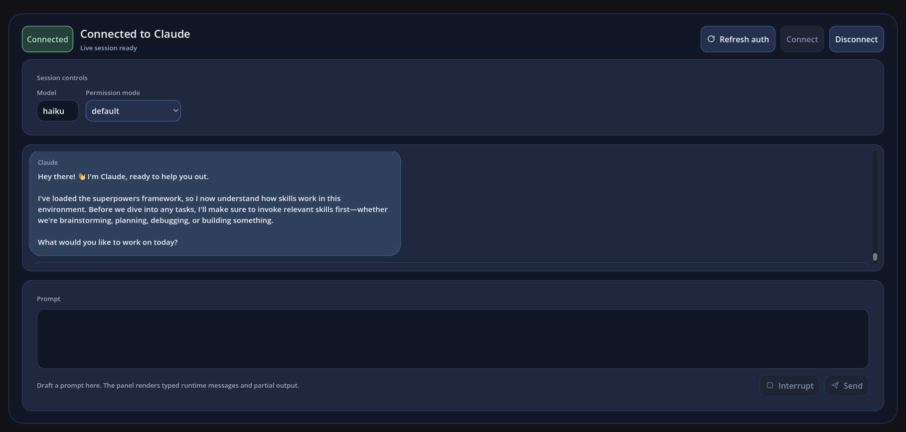

# Claude Agent SDK for GDScript

Claude Agent SDK for GDScript brings the Claude Agent SDK model to Godot. It gives Godot projects a scene-free runtime, Godot-native adapters, and a reusable chat panel that talk to the locally installed `claude` CLI.

The project is already usable for desktop/editor workflows in Godot `4.6`. You can embed the low-level runtime in your own tools, use the adapter and node layers for Godot integration, or drop in the shipped `ClaudeChatPanel` as a reference UI and starting point.

## UI Preview

The shipped demo scene uses the same `ClaudeChatPanel` that is included in the addon. Release/listing screenshot assets are tracked under `docs/release/assets/README.md`.



## Install

### GitHub Release ZIP

1. Download the latest tested GitHub Release ZIP.
2. Extract it into your Godot project root.
3. Confirm the addon is installed at `res://addons/claude_agent_sdk/`.

### Godot Asset Library

The Asset Library listing is intended to resolve to the same tested GitHub Release ZIP, so the installed layout is identical:

- `res://addons/claude_agent_sdk/`

The current addon does not require `plugin.cfg`, autoload setup, or editor-plugin enablement.

## Requirements

- Godot `4.6`
- A user-installed `claude` CLI, either available on `PATH` or configured through `cli_path`
- Existing Claude auth handled by the local CLI

## Compatibility

- desktop/editor workflows supported
- exported macOS support limited to the validated unsandboxed scenarios
- mobile, web, and App Store-sandboxed macOS workflows remain out of scope

## What Ships

- A scene-free runtime core under `addons/claude_agent_sdk/runtime/`
- `ClaudeQuery` for one-shot usage
- `ClaudeSDKClient` for interactive runtime usage
- `ClaudeSessions` for local session history access, richer transcript detail reading, and basic session mutations
- `ClaudeSessionTranscriptEntry` for normalized historical transcript detail
- `ClaudeForkSessionResult` plus explicit session forking helpers for branching saved conversations
- `ClaudeAgentDefinition` plus runtime-first agent-definition support and `setting_sources` control
- transport-first advanced CLI option parity through `ClaudeAgentOptions`, including `continue_conversation`, `fallback_model`, `betas`, `permission_prompt_tool_name`, `add_dirs`, `max_budget_usd`, `thinking`, `max_thinking_tokens`, and `task_budget`
- transport-first `settings` and `sandbox` parity through `ClaudeAgentOptions`, including upstream-style `--settings` pass-through and sandbox merge behavior
- transport-first diagnostics parity through `ClaudeAgentOptions.extra_args` and `ClaudeAgentOptions.stderr`
- transport-owned buffered stdout parsing parity through `ClaudeAgentOptions.max_buffer_size`, including split/minified JSON recovery and stray non-JSON stdout skip behavior
- transport-first plugin-dir and `fork_session` option parity through `ClaudeAgentOptions.plugins` and `ClaudeAgentOptions.fork_session`
- transport-first file-checkpointing parity through `ClaudeAgentOptions.enable_file_checkpointing` plus runtime `rewind_files()` controls on `ClaudeSDKClient`, `ClaudeClientAdapter`, and `ClaudeClientNode`
- task-control parity through runtime `stop_task()` controls plus typed `task_started`, `task_progress`, and `task_notification` system messages
- typed `rate_limit_event` parity through `ClaudeRateLimitInfo`, `ClaudeRateLimitEvent`, and system-path rendering in the shipped chat panel
- typed live-diagnostics parity through `ClaudeContextUsageResponse` and `ClaudeMcpStatusResponse`, including nested context/MCP status models used by the runtime and shipped panel
- interactive prompt-on-connect parity through `connect_client(prompt)` on `ClaudeSDKClient`, `ClaudeClientAdapter`, and `ClaudeClientNode`
- typed hook-input helpers through `ClaudeHookInput` plus event-specific hook input classes, exposed additively on `ClaudeHookContext.typed_input` / `hook_input` while preserving raw dictionary callback inputs
- typed hook-output helpers through `ClaudeHookOutput` plus event-specific hook output classes, with additive runtime coercion for legacy dictionary callbacks
- typed permission-update helpers through `ClaudePermissionUpdate` and `ClaudePermissionRuleValue`, with additive typed suggestion exposure on `ClaudeToolPermissionContext`
- transport-first process-user launch parity through `ClaudeAgentOptions.user` on POSIX shell-backed transports
- `ClaudeMcp`, `ClaudeMcpTool`, `ClaudeMcpToolAnnotations`, and `ClaudeSdkMcpServer` for scene-free SDK-hosted MCP tool definitions
- `ClaudeBuiltInToolCatalog` for scene-free built-in Claude Code tool metadata and selection mapping
- `ClaudeClientAdapter` and `ClaudeClientNode` for Godot-friendly integration, including session-history and transcript-detail convenience methods
- `ClaudeChatPanel` as a reusable reference chat UI with a conversation-first `Chat` view, secondary `Settings` view, saved-session browsing, truthful reconnect/resume handoff, full-session plus saved-session cutoff forking from chat bubbles and transcript detail cards, task-aware transcript controls, connected-session context/MCP diagnostics, disconnected chat-configuration controls, transcript-level rewind actions, and disconnected connect-and-send composer behavior
- A root-project demo under `demo/` for validation and onboarding

Only `addons/claude_agent_sdk/` is the distributable addon payload. The `demo/`, `tests/`, and `tools/` directories stay outside the packaged artifact.

## Quick Start

### One-shot query

```gdscript
var options := ClaudeAgentOptions.new()
options.model = "haiku"
options.effort = "low"

var stream := ClaudeQuery.query("Summarize this level script.", options)
var messages := await stream.collect()

for message in messages:
	if message is ClaudeAssistantMessage:
		for block in message.content:
			if block is ClaudeTextBlock:
				print(block.text)
```

### Godot node integration

```gdscript
@onready var client: ClaudeClientNode = $ClaudeClientNode

func _ready() -> void:
	client.session_ready.connect(_on_session_ready)
	client.turn_message_received.connect(_on_turn_message)
	client.turn_finished.connect(_on_turn_finished)
	client.connect_client()

func _on_session_ready(_server_info: Dictionary) -> void:
	client.query("Give me a short design critique for this scene.")
```

### Reusable chat panel

```gdscript
@onready var chat_panel: ClaudeChatPanel = $ClaudeChatPanel

func _ready() -> void:
	var options := ClaudeAgentOptions.new()
	options.model = "haiku"
	options.effort = "low"
	chat_panel.setup(options)
```

## Supported Features

- Claude CLI subprocess transport with inherited environment and explicit overrides
- Typed message parsing for user, assistant, system, result, and partial stream events
- One-shot queries plus interactive connected sessions
- Local session history access for session listing, metadata lookup, visible-message reading, richer transcript-detail reading, session forking, and basic rename/tag/delete mutations
- Interrupt, model switching, permission-mode switching, context usage, and MCP status controls
- Typed live context/MCP diagnostics through `ClaudeContextUsageResponse`, `ClaudeMcpStatusResponse`, and nested status/category models
- Hook callbacks, tool-permission callbacks, structured output, and partial-message support
- additive typed hook-input wrappers through `ClaudeHookContext.typed_input` / `hook_input` while keeping hook callbacks dictionary-first for compatibility
- Typed hook-output helpers plus typed permission-update/result helpers for runtime callback integrations
- Scene-free SDK-hosted MCP tool/server builders plus mixed external/SDK `mcp_servers` runtime support
- Runtime-first agent definitions through `ClaudeAgentOptions.agents` and initialize-payload serialization
- `setting_sources` support for controlling user/project/local Claude settings loading
- transport-first advanced CLI options through `ClaudeAgentOptions`, including `continue_conversation`, `fallback_model`, `betas`, `permission_prompt_tool_name`, `add_dirs`, `max_budget_usd`, `thinking`, deprecated `max_thinking_tokens`, and `task_budget`
- transport-first `settings` and `sandbox` support through `ClaudeAgentOptions`, including plain `settings` pass-through and sandbox-to-`--settings` JSON merging
- transport-first diagnostics support through `ClaudeAgentOptions.extra_args` and per-line stderr callback delivery
- transport-owned buffered stdout parsing support through `ClaudeAgentOptions.max_buffer_size`, including split/minified JSON recovery and non-JSON stdout skip behavior
- transport-first local-plugin and `fork_session` option support through `ClaudeAgentOptions.plugins` and `ClaudeAgentOptions.fork_session`
- transport-first file checkpointing through `ClaudeAgentOptions.enable_file_checkpointing` and connected-session `rewind_files(user_message_id)` controls
- task-control support through connected-session `stop_task(task_id)` controls and typed task system messages
- typed `rate_limit_event` parsing plus reference-panel rendering through the existing `System` transcript path
- transport-first process-user launch support through `ClaudeAgentOptions.user` on POSIX shell-backed transports
- streamed prompt input support through `ClaudePromptStream` on `ClaudeQuery.query()` and `ClaudeSDKClient.query()`
- interactive prompt-on-connect support through `connect_client(prompt)` on `ClaudeSDKClient`, `ClaudeClientAdapter`, and `ClaudeClientNode`, including string and `ClaudePromptStream` inputs
- Richer `system_prompt` modes, including plain text, `claude_code` preset, preset+append, and file-backed prompts
- Base built-in tool-set selection through `ClaudeAgentOptions.tools`, composed with `allowed_tools` and `disallowed_tools`
- Scene-free built-in tool catalog metadata and selection helpers for custom panel/tool-picker UIs
- Godot-native adapter and node layers with session-history and transcript-detail convenience passthroughs
- A reusable chat panel plus demo validation scene, now including a conversation-first main view, quick model/effort/permission controls, a secondary settings view for prompt/tool configuration plus connected-session context/MCP diagnostics, session browsing, transcript restoration, transcript granularity filters for thinking/tasks/tools/results/system/raw, disconnected connect-and-send composer flows, truthful saved-session reconnect handoff, basic rename/tag/delete/fork actions, saved-session cutoff forks from chat bubbles and detail cards, and live task stop controls

## Current Gaps

Most of the pinned upstream baseline is covered, but one transport caveat still remains:

- `ClaudeAgentOptions.user` is implemented through a POSIX shell-wrapper launch path; Windows shell-backed transports currently reject it

Use these as the canonical sources of truth for compatibility and parity status:

- `docs/parity/feature-matrix.md`
- `docs/parity/upstream-ledger.md`
- `CHANGELOG.md`

## Documentation

### User docs

- `docs/contributing/integration.md`
- `docs/contributing/session-history.md`
- `docs/contributing/ui-panel.md`
- `docs/release/install.md`

### Maintainer docs

- `docs/contributing/workflow.md`
- `docs/contributing/automation.md`
- `docs/contributing/maintainer-workflow.md`
- `docs/contributing/testing.md`

### Release docs

- `docs/release/packaging.md`
- `docs/release/release-process.md`
- `docs/release/asset-library.md`

### Parity and project docs

- `docs/parity/feature-matrix.md`
- `docs/parity/upstream-ledger.md`
- `docs/roadmap/roadmap.md`

## Known Limitations

- The addon depends on a user-installed `claude` CLI.
- Claude auth remains CLI-owned rather than SDK-owned.
- The runtime API is scene-free, but the subprocess transport still expects an active Godot `SceneTree`.
- SDK-hosted MCP/custom-tool registration stays code-driven through `ClaudeMcp` and `ClaudeAgentOptions.mcp_servers`; the panel shows the active MCP environment but does not author tool handlers.
- SDK-hosted MCP tool handlers should return `{ "content": [...], "is_error": true }` for tool-level failures; uncaught GDScript runtime faults still surface as normal Godot errors.
- advanced CLI transport options stay transport-only in this slice; they do not appear in initialize payloads.
- `permission_prompt_tool_name` cannot be combined with `can_use_tool`; the existing `can_use_tool` path still auto-configures the CLI permission prompt tool as `stdio`.
- `can_use_tool` now follows upstream query-surface behavior: string prompts are rejected and you must provide a `ClaudePromptStream`.
- `thinking` now takes precedence over the deprecated `max_thinking_tokens` field when both are configured.
- `settings` stays string-based in the current slice, matching upstream transport behavior: either a raw JSON string or a file path.
- `sandbox` is transport-only in the current slice and is implemented by building a `--settings` value; it does not add new initialize payload fields.
- `extra_args` and `stderr` are also transport-only in the current slice; they do not enter initialize payloads.
- `max_buffer_size` is also transport-only in the current slice; it controls local stdout buffering and does not enter initialize payloads or CLI argument serialization.
- `plugins` and `fork_session` are also transport-only in the current slice; they do not enter initialize payloads.
- `enable_file_checkpointing` is also transport-only in the current slice; it does not enter initialize payloads.
- `user` is also transport-only in the current slice; it does not enter initialize payloads.
- practical rewind workflows usually also need `extra_args = {"replay-user-messages": null}` so live `UserMessage.uuid` values are available to rewind to.
- `plugins` currently supports only local plugin configs with `{ "type": "local", "path": String }`.
- `ClaudeAgentOptions.user` currently targets POSIX shell-backed transports by wrapping the launch with `sudo -n -u`; Windows transports reject it.
- the deprecated Python `debug_stderr` shim is intentionally not mirrored in GDScript; use `ClaudeAgentOptions.stderr` and optional `extra_args = {"debug-to-stderr": null}` instead.
- The shipped panel is a reference UI, not a replacement for the lower runtime and adapter layers.
